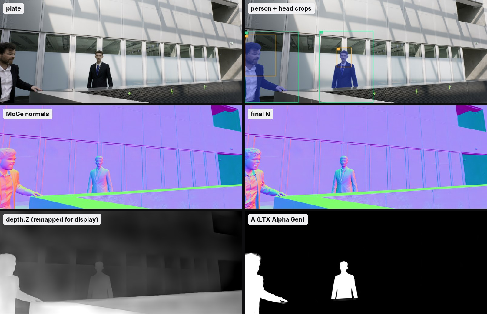
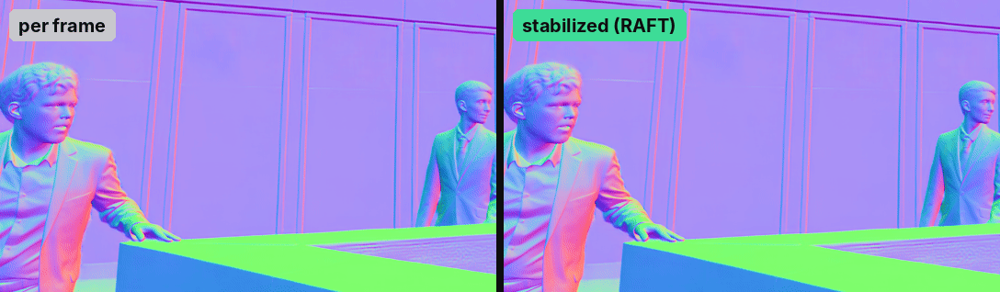
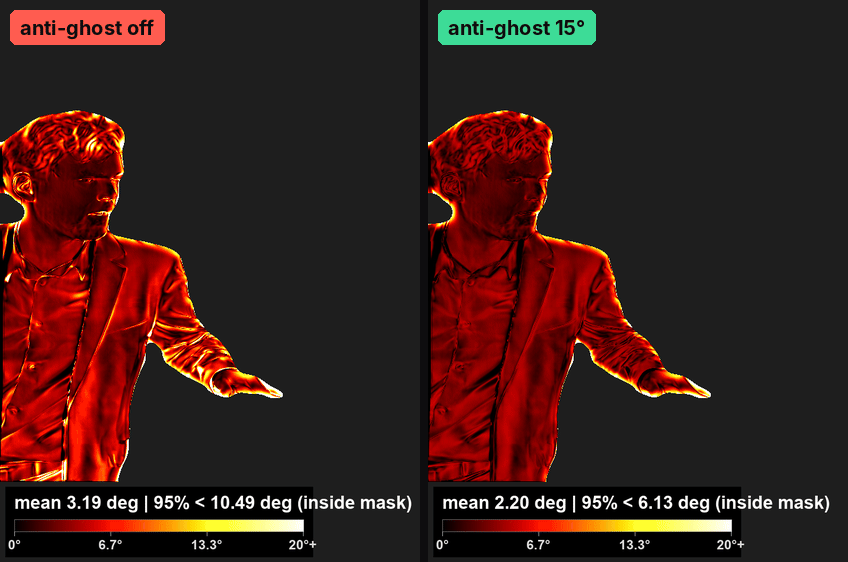
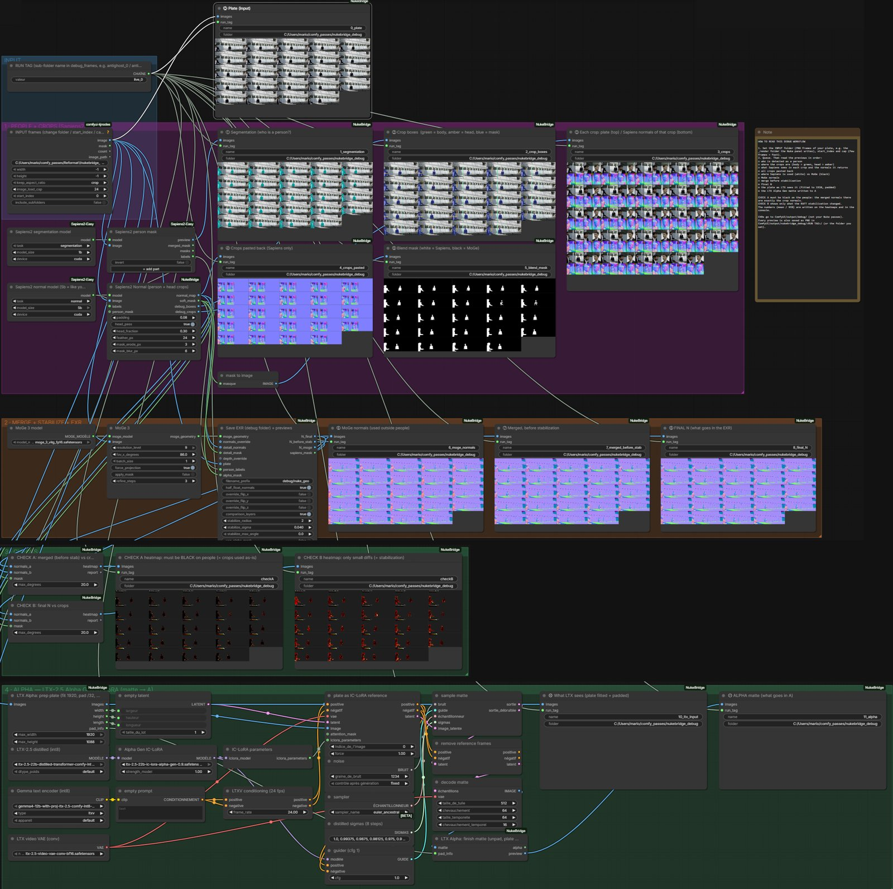

# Nuke × ComfyUI bridge

Generates normals, depth, position and an alpha matte for a plate in ComfyUI, from a panel in Nuke. One multi-layer EXR per frame comes back as a Read.

Personal compositing experiment, tested on Windows with an RTX 3090 (24 GB) and ComfyUI 0.38.



## Output

| layer | content |
|---|---|
| `N` | camera-space normals: Sapiens2 on the people, MoGe on the rest, stabilized over time |
| `depth.Z` | metric depth in metres (Video Depth Anything) |
| `P` | position, from `depth.Z` and the MoGe camera |
| `A` | alpha matte from LTX-2.5 Alpha Gen (soft edges, hair), or the Sapiens2 segmentation if you switch LTX off |

## How the normals are made

1. Sapiens2 segmentation finds the people.
2. Each person gets a 3:4 crop (the Sapiens2 input ratio), plus one on the head (placed on the face and hair pixels of the segmentation). The body crops are fixed over each batch of frames; the head crop keeps a fixed size but follows the head, with its position smoothed over time. Each crop goes through Sapiens2 normal at its native resolution and is pasted back with a feathered edge.
3. Sapiens2 is kept inside the person mask, MoGe outside.
4. Stabilization: the 2 frames before and after are warped onto the current frame with optical flow (RAFT) and averaged. A neighbour is ignored where the warped plate doesn't match (occlusion) or where its normal differs by more than ~15° (fast motion, which would leave a trail).



Anti-ghost on a person walking into frame (heatmap = how much stabilization changed the normals):



## How the alpha is made

The plate goes through [LTX-2.5 Alpha Gen](https://huggingface.co/Lightricks/LTX-2.5-22b-IC-LoRA-Alpha-Gen), an IC-LoRA for the LTX-2.5 video model that turns an RGB clip into a matte. LTX takes at most 1920×1088, sizes that are multiples of 32 and 8n+1 frames, so two small nodes fit the plate into those limits (scaled down without stretching, padded) and put the matte back at the plate size afterwards.

## Install

### 1. ComfyUI

Copy `comfyui/ComfyUI-NukeBridge` into `ComfyUI/custom_nodes/`, then install these node packs (ComfyUI Manager finds them from the workflow's missing nodes):

- [ComfyUI-KJNodes](https://github.com/kijai/ComfyUI-KJNodes)
- [ComfyUI-Sapiens2-Easy](https://github.com/Bogyie/ComfyUI-Sapiens2-Easy)
- [ComfyUI-Video-Depth-Anything](https://github.com/yuvraj108c/ComfyUI-Video-Depth-Anything)
- MoGe is built into ComfyUI (0.37 or later).

### 2. Models

| model | file | where |
|---|---|---|
| MoGe 3 ViT-g | `moge_3_vitg_fp16.safetensors` from [Comfy-Org/MoGe](https://huggingface.co/Comfy-Org/MoGe/tree/main/geometry_estimation) | `ComfyUI/models/geometry_estimation/` |
| Sapiens2 segmentation 1B + normal 1B | downloaded by Sapiens2-Easy on first run | `ComfyUI/models/sapiens2/` |
| Video Depth Anything, metric Large | `metric_video_depth_anything_vitl.pth`, downloaded automatically by the VDA pack on first run | `ComfyUI/models/videodepthanything/` |
| RAFT large | downloaded by torchvision on first run | torch cache |
| LTX-2.5 distilled, int8 | `ltx-2.5-22b-distilled-transformer-comfy-int8-convrot.safetensors` from [Lightricks/LTX-2.5](https://huggingface.co/Lightricks/LTX-2.5/tree/main/diffusion_models) | `ComfyUI/models/diffusion_models/` |
| Gemma text encoder, int8 | `gemma4-12b-with-proj-ltx-2.5-comfy-int8-convrot.safetensors` from [Lightricks/LTX-2.5](https://huggingface.co/Lightricks/LTX-2.5/tree/main/text_encoders) | `ComfyUI/models/text_encoders/` |
| LTX-2.5 video VAE (conv) | `ltx-2.5-video-vae-conv-bf16.safetensors` from [Lightricks/LTX-2.5](https://huggingface.co/Lightricks/LTX-2.5/tree/main/vae) | `ComfyUI/models/vae/` |
| Alpha Gen IC-LoRA | `ltx-2.5-22b-ic-lora-alpha-gen-0.9.safetensors` from [Lightricks/LTX-2.5-22b-IC-LoRA-Alpha-Gen](https://huggingface.co/Lightricks/LTX-2.5-22b-IC-LoRA-Alpha-Gen) | `ComfyUI/models/loras/` |

The LTX repositories are gated: log in to Hugging Face and accept the licence on both pages before downloading. The LTX nodes are built into ComfyUI, no extra pack needed. Use the int8 files: the bf16 versions (42 GB transformer) don't fit on a 24 GB card.

Restart ComfyUI.

### 3. Nuke

Paste `nuke/menu_snippet.py` at the end of `~/.nuke/menu.py` and set `BRIDGE_ROOT` to the `nuke` folder of this repository. Restart Nuke: **ComfyUI › Generate passes…** (`Ctrl+Alt+G`).

ComfyUI is expected at `http://127.0.0.1:8188` (editable in the panel, or set `COMFY_BRIDGE_URL`).

## Use

Select a Read (or any node), open the panel, check the frame range and output folder, press **Generate**.

- The frames are rendered as the viewer shows them (same OCIO display / view), because the models expect display-referred images.
- They are sent in batches of 25 frames, with 2 extra frames on each side so the stabilization has neighbours at batch boundaries.
- The EXRs are written to `<output>/<source name>/<workflow>/geo/` and loaded as a raw Read.

### Settings in the panel

| setting | default | what it does |
|---|---|---|
| fov_x_degrees | 86 | horizontal FOV of the camera used for `P`; 0 = estimated by MoGe per frame |
| MoGe resolution_level | 9 | MoGe detail level (0–9); lower is faster |
| N stabilize radius | 2 | frames on each side used for stabilization; 0 = off |
| N stabilize sigma | 0.04 | tolerance on the plate match after warping; lower = fewer ghosts, less smoothing |
| N anti-ghost max angle | 15 | neighbours whose normal differs by more than this (degrees) are ignored; 0 = off |
| VDA max_res | 1280 | max resolution for depth; lower if you run out of VRAM |
| Sapiens normal size | 1b | Sapiens2 normal model size (bigger = more detail, slower) |
| Sapiens head pass | on | extra crop on each head for sharper faces |
| Sapiens crop padding | 0.08 | margin around each person crop |
| write comparison layers | off | also writes `Nraw` (before stabilization), `Nmoge` and `depth_moge`, to compare |
| Alpha from LTX | on | off = `A` is the Sapiens2 segmentation instead (harder edges); the LTX part is then skipped, which is much faster |
| Alpha (LTX) max width | 1920 | width the plate is fitted to for LTX; lower if you run out of VRAM |
| Alpha (LTX) seed | 1234 | seed of the matte pass |

## Your own workflows

The panel lists every API-format workflow in `nuke/comfy_bridge/workflows/` (in ComfyUI: **Workflow › Export (API)**). To work with the bridge, a workflow needs:

- a **Load Images From Folder (KJ)** node titled `NUKE_INPUT`: the bridge fills in the folder and the frame count;
- one save node whose `filename_prefix` starts with `nuke_` and that writes one file per frame. The rest of the prefix is the pass name (`nuke_normal` → `normal`). An EXR save node gives `.exr` files, anything else `.png`.

Optional: a top-level `"_nuke_bridge"` entry in the JSON sets the description, the batch size and the settings shown in the panel:

```json
"_nuke_bridge": {
  "name": "My normals",
  "description": "Sapiens2 normals only",
  "chunk": 25,
  "overlap": 2,
  "params": {"Steps": ["5", "steps"]}
}
```

`params` maps a label to `[node id, input name]`. Without `chunk`, the whole range is sent in one batch.

## Workflows for the ComfyUI editor

- `comfyui/workflows/NukeBridge_all_UI.json`: the same graph the panel runs.
- `comfyui/workflows/NukeBridge_DEBUG_UI.json`: the same graph with a preview after every step (including the plate as LTX sees it and the final matte), saved as PNGs in `ComfyUI/output/nukebridge_debug/<RUN TAG>/`, to compare two runs.



## Limits

- The person crops are fixed per batch: someone crossing the frame gets a large crop and less detail.
- Very fast motion can still soften a little after stabilization.
- Depth and camera are estimates: fine for relighting or defocus, not for matchmove.
- The matte is computed at 1920 wide at most: on larger plates it is scaled back up, so its edges are a bit softer than the plate.
- LTX is heavy: it ran on an RTX 3090 (24 GB) with 128 GB of system RAM, ComfyUI offloading weights as needed. With less RAM or VRAM, lower the LTX max width.

## Credits and licences

Code: [MIT](LICENSE), Mario Falco.

Plate: *Léviathan*, ArtFX Paris, promo 2026. The images in `docs/media` are not covered by the MIT licence.

The models have their own licences, which apply to their weights; check them before any commercial use:
[Sapiens2](https://github.com/facebookresearch/sapiens2) (Meta Sapiens2 licence) ·
[MoGe](https://github.com/microsoft/MoGe) ·
[Video Depth Anything](https://github.com/DepthAnything/Video-Depth-Anything) (Large / metric Large: CC-BY-NC-4.0, non-commercial) ·
RAFT via torchvision (BSD-3-Clause) ·
[LTX-2.5](https://huggingface.co/Lightricks/LTX-2.5) and Alpha Gen (LTX-2.x Community License: free for commercial use under $10M annual revenue).
